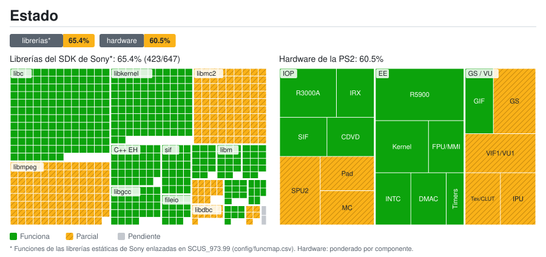
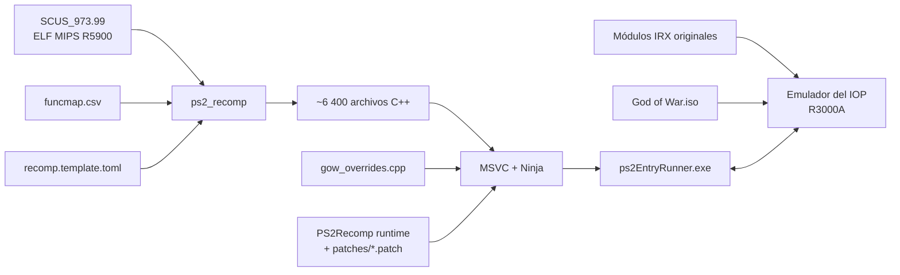

<div align="center">

# God of War — PS2 Static Recompilation

[English](README.md) · **Español** · [Português (Brasil)](README.pt-BR.md)

**Port nativo para PC de *God of War* (PS2, NTSC-U `SCUS-97399`) mediante recompilación estática de MIPS R5900 a C++.**


[](https://github.com/KIexster/god-of-war-recomp/actions/workflows/pruebas.yml)

</div>

---

> [!IMPORTANT]
> Este repositorio **no contiene ningún archivo del juego** (ISO, ejecutable, módulos IRX ni datos `.PAK`)
> ni el código C++ generado a partir de él. Necesitas **tu propia copia legal** de God of War para PS2.

## Índice

- [Qué es](#qué-es)
- [Estado actual](#estado-actual)
- [Estructura del repositorio](#estructura-del-repositorio)
- [Requisitos](#requisitos)
- [Compilar y ejecutar](#compilar-y-ejecutar)
- [Cómo funciona](#cómo-funciona)
- [Documentación](#documentación)
- [Créditos y licencia](#créditos-y-licencia)

## Qué es

En lugar de emular la PlayStation 2 instrucción por instrucción, este proyecto **traduce el ejecutable
original del juego (`SCUS_973.99`) a código C++** con [PS2Recomp](https://github.com/ran-j/PS2Recomp),
y lo compila como un programa nativo de Windows enlazado contra un runtime que reimplementa el hardware
y el sistema operativo de la PS2 (kernel del EE, GS, DMA, CD/DVD…). El procesador de E/S (IOP) ejecuta
los **módulos IRX originales** del juego (driver de sonido, cargador de datos…) en el intérprete R3000A de
PS2Recomp.

Este repositorio contiene todo lo específico de God of War:

| Componente | Descripción |
|---|---|
| **Mapa de funciones** | 6 414 funciones identificadas en el ELF (`config/funcmap.csv`) |
| **Configuración del recompilador** | Stubs, puntos de entrada (incluidos métodos virtuales a los que solo se llega por vtable) y parches de instrucciones (`config/recomp.template.toml`) |
| **Overrides del juego** | Reemplazos y diagnósticos de funciones del juego (`src/gow_overrides.cpp`) |
| **Parche del runtime** | Correcciones al emulador del IOP y al runtime del EE de PS2Recomp que necesita este juego (`patches/`) |
| **Scripts de compilación** | Pipeline completo y reproducible en Windows (`scripts/`) |
| **Herramientas** | Extractor de la capa 1 de DVD-9 (`tools/`) |

## Estado actual

<a href="docs/estado/detalle.es.md"></a>

Desglose por librería y por componente: [`docs/estado/detalle.es.md`](docs/estado/detalle.es.md). Se regenera a partir de `docs/estado/datos.toml` con `tools/estado/generar.py` (y automáticamente al subir a `main`).

| Hito | Estado |
|---|:---:|
| Extracción de ambas capas del DVD-9 | ✅ |
| Recompilación de `SCUS_973.99` a C++ (6 418 archivos) | ✅ |
| Compilación del ejecutable nativo (MSVC, x64) | ✅ |
| Arranque: inicialización de raylib/OpenGL, heap y threads | ✅ |
| IRX originales del juego en el emulador del IOP (`989snd`, `smpd`, `libsd`…) | ✅ |
| Carga de datos desde la ISO original (`smpd` → `R_PERM.WAD`, configuración) | ✅ |
| Bucle principal del juego (`sys::GameLoop`) | ✅ |
| Salida de vídeo: pantalla legal y logo del título | ✅ |
| Barco, Kratos, enemigos y HUD con formas correctas; faltan otros controles de renderizado | 🔧 en progreso |
| Mando/teclado por HLE de libpad2; menú y selección de dificultad | ✅ |
| Partida alcanzada; rendimiento todavía de ~2–3 fps | 🔧 en progreso |
| Vídeo FMV: intro decodificada y presentada sin omitirla; faltan otros vídeos | 🔧 en progreso |
| Audio: bancos y sonido continuo emulado verificados; salida entrecortada a la velocidad actual | 🔧 en progreso |
| Memory card: listar, cargar, guardar y recargar verificados en una copia PCSX2; falta formateo | 🔧 en progreso |

El juego arranca, carga sus datos desde la ISO y llega al menú y a la partida con teclado o mando.
Tras corregir las cadenas DMA del scratchpad, las capturas muestran el barco, Kratos, enemigos y HUD
con formas correctas. La intro FMV también se decodifica sin `GOW_SKIP_FMV`. Se han verificado cargar,
guardar y recargar una partida en una copia de tarjeta PCSX2 de 8 MB con ECC; faltan formateo y reapertura
en PCSX2. El port sigue siendo experimental: la partida va a ~2–3 fps, el audio se oye entrecortado y
quedan diferencias CPU/OpenGL y cobertura gráfica por comprobar. Ver [renderizado](docs/COMPARACION_PCSX2.md),
[FMV y audio](docs/FMV_Y_AUDIO.md), [memory card](docs/MEMORY_CARD.md) y
[`docs/ESTADO.md`](docs/ESTADO.md) para los controles y sus límites.

## Estructura del repositorio

```
.
├── .github/workflows/            # CI: pruebas (pruebas.yml) y mapa de estado (estado.yml)
├── AGENTS.md                     # Convenciones del proyecto para colaboradores y agentes
├── config/
│   ├── funcmap.csv               # Mapa de funciones (nombre, inicio, fin, tamaño)
│   └── recomp.template.toml      # Configuración de PS2Recomp (@ELF@, @MAP@, @OUT@)
├── docs/                         # Documentación técnica
│   └── estado/                   # Datos del mapa de estado y SVG/tablas generados
├── game/                         # Aquí va TU SCUS_973.99 (ignorado por git)
├── patches/
│   └── ps2recomp-*.patch         # Cambios sobre PS2Recomp @ c5a9d02, aplicados en orden
├── scripts/
│   ├── 1_instalar_herramientas.cmd
│   ├── 2_compilar.cmd            # Pipeline completo de compilación
│   ├── 2_recompilar_rapido.cmd   # Recompila solo src/gow_overrides.cpp (~1 min)
│   ├── 3_ejecutar.cmd            # Ejecuta 60 s y guarda logs
│   ├── 3_ejecutar_manual.cmd     # Ejecuta sin límite de tiempo
│   ├── probar_menu.ps1           # Prueba del menú con capturas del GS
│   ├── probar_pad2.cmd           # Compila y ejecuta la prueba de paquetes de libpad2
│   ├── monitor.cmd               # Monitoriza CPU/RAM durante la compilación
│   └── *.ps1                     # Lógica de los scripts
├── src/
│   ├── gow_overrides.cpp         # Overrides específicos del juego
│   └── gow_pad2_packet.h         # Formato del paquete de libpad2 (probado)
├── tests/                        # Pruebas independientes del juego y fallos conocidos de la suite
└── tools/
    ├── ci/                       # Ayudas de la CI (orden de parches, config, pruebas)
    ├── extraer_capa2.ps1         # Extrae la capa 1 de una ISO DVD-9 de PS2
    └── estado/generar.py         # Generador del mapa de estado
```

## Requisitos

- Windows 10/11 x64
- [Visual Studio 2022 Build Tools](https://visualstudio.microsoft.com/downloads/) con la carga de trabajo **C++** (incluye CMake y Ninja)
- [Git](https://git-scm.com/)
- ~10 GB libres y 16 GB de RAM recomendados (la compilación usa todos los núcleos)
- Una copia propia de **God of War (NTSC-U, SCUS-97399)**

`scripts\1_instalar_herramientas.cmd` instala Git y las Build Tools con `winget`.

## Compilar y ejecutar

**1. Obtén los archivos del juego.** Copia el ejecutable de tu disco/ISO a `game\SCUS_973.99`
(o define la variable de entorno `GOW_ELF` con su ruta).

Junto al ELF deben estar también los **módulos `.IRX`** del disco (`SMPD_IOP.IRX`, `989NOMID.IRX`,
`LIBSD.IRX`…): el emulador del IOP ejecuta los originales y `scripts\ejecutar.ps1` los copia a `IOP_MOD\`
la primera vez. Para leer los datos del juego hace falta la **ISO original**: llámala `God of War.iso` y
ponla en la carpeta superior a la del ELF, o indica su ruta con la variable de entorno `GOW_ISO`.

Si además quieres los datos de la segunda capa del DVD:

```powershell
powershell -ExecutionPolicy Bypass -File tools\extraer_capa2.ps1 -Iso "D:\God of War.iso" -Salida "D:\GOW ISO extraida"
```

**2. Instala las herramientas** (solo la primera vez):

```bat
scripts\1_instalar_herramientas.cmd
```

**3. Compila** (20–40 min la primera vez):

```bat
scripts\2_compilar.cmd
```

El script clona PS2Recomp en `<unidad>:\gowport` (ruta corta para esquivar el límite de 260 caracteres;
configurable con `GOW_WORK`), fija el commit `c5a9d02`, aplica los parches de `patches/`, genera el C++ y compila
`ps2EntryRunner.exe`. El registro queda en `logs\2_compilar.log`.

Las compilaciones Release desactivan por defecto las trazas de funciones y RPC del IOP. Para
investigar, usa `scripts\2_compilar.cmd -Trazas`. Para medir las llamadas a `vid::Flip` del juego
por separado del refresco de la ventana, ejecuta `powershell -File scripts\probar_rendimiento.ps1`;
consulta [las notas del perfil](docs/ESTADO.md#medicion-de-rendimiento-2026-10-05).

**4. Ejecuta:**

```bat
scripts\3_ejecutar.cmd          :: 60 segundos, salida en logs\
scripts\3_ejecutar_manual.cmd   :: sin límite
```

## Cómo funciona



Más detalles en [`docs/ARQUITECTURA.md`](docs/ARQUITECTURA.md).

## Documentación

- [`docs/ARQUITECTURA.md`](docs/ARQUITECTURA.md) — pipeline, overrides, parches del runtime e integración continua
- [`docs/CONTROLES.md`](docs/CONTROLES.md) — controles y pruebas del mando y del menú
- [`docs/RENDERIZADO.md`](docs/RENDERIZADO.md) — renderers CPU/CPU con hilo/OpenGL opcionales y comparaciones
- [`AGENTS.md`](AGENTS.md) — convenciones del proyecto para colaboradores y agentes
- [`docs/ESTADO.md`](docs/ESTADO.md) — estado actual, registro de la investigación, problemas conocidos y próximos pasos

## Créditos y licencia

- [**PS2Recomp**](https://github.com/ran-j/PS2Recomp) de ran-j y colaboradores — recompilador y runtime (GPL-3.0).
- [**Fork del runtime de SotC**](https://github.com/LightVelox/PS2Recomp/tree/ac9efa070638ad3b3accd284de6f898d5ab271d1) de Taylor N. Albarnaz / LightVelox — backend GS OpenGL y cola de comandos, y arreglos del EE (FPU, ramas de 64 bits, LQ/SQ, saltos finales, VU0 en modo macro y cadenas DMA largas) (GPL-3.0, `ac9efa0`).
- *God of War* © Sony Interactive Entertainment / Santa Monica Studio. Este proyecto no está afiliado
  ni respaldado por Sony. No se distribuye ningún contenido del juego.

El código de este repositorio se publica bajo la licencia **GPL-3.0**, en coherencia con PS2Recomp.
Ver [`LICENSE`](LICENSE).
