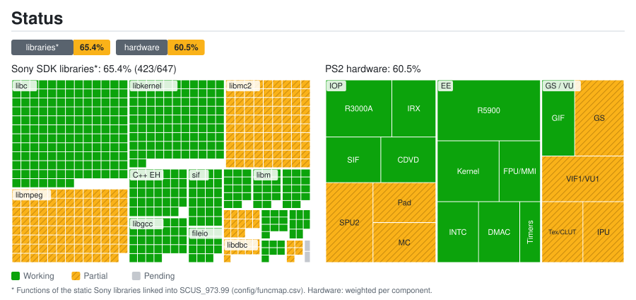

<div align="center">

# God of War — PS2 Static Recompilation (Tobiichi Port)

**English** · [Español](README.es.md) · [Português (Brasil)](README.pt-BR.md)

**A native PC port of *God of War* (PS2, NTSC-U `SCUS-97399`) built by statically recompiling MIPS R5900 code to C++.**


[](https://github.com/KIexster/god-of-war-recomp/actions/workflows/pruebas.yml)

</div>

---

> [!IMPORTANT]
> This repository **does not contain any game files** (ISO, executable, IRX modules or `.PAK` data),
> nor the C++ code generated from them. You need **your own legal copy** of God of War for the PS2.

## Contents

- [What is this?](#what-is-this)
- [Current status](#current-status)
- [Repository layout](#repository-layout)
- [Requirements](#requirements)
- [Building and running](#building-and-running)
- [How it works](#how-it-works)
- [Documentation](#documentation)
- [Credits and license](#credits-and-license)

## What is this?

Instead of emulating the PlayStation 2 one instruction at a time, this project **translates the game's
original executable (`SCUS_973.99`) into C++** with [PS2Recomp](https://github.com/ran-j/PS2Recomp) and
compiles it as a native PC program, linked against a runtime that reimplements the PS2 hardware and
operating system (EE kernel, GS, DMA, CD/DVD…). The I/O processor (IOP) runs the game's **original IRX
modules** (sound driver, data streamer…) on PS2Recomp's R3000A interpreter.

This repository holds everything that is specific to God of War:

| Component | Description |
|---|---|
| **Function map** | 6,414 functions identified in the ELF (`config/funcmap.csv`) |
| **Recompiler configuration** | Stubs, entry points (including vtable-only virtual methods) and instruction patches (`config/recomp.template.toml`) |
| **Game overrides** | Hand-written replacements and diagnostics for game functions (`src/gow_overrides.cpp`) |
| **Runtime patch** | Fixes to PS2Recomp's IOP emulator and EE runtime needed by this game (`patches/`) |
| **Build scripts** | A complete, reproducible Windows & Linux pipeline (`scripts/`) |
| **Tools** | DVD-9 layer 1 extractor (`tools/`) |

## Current status

<a href="docs/estado/detalle.en.md"></a>

Per-library and per-component breakdown: [`docs/estado/detalle.en.md`](docs/estado/detalle.en.md). Regenerated from `docs/estado/datos.toml` by `tools/estado/generar.py` (and automatically on push to `main`).

| Milestone | Status |
|---|:---:|
| Extracting both layers of the DVD-9 | ✅ |
| Recompiling `SCUS_973.99` to C++ (6,418 files) | ✅ |
| Building the native executable (MSVC / GCC / Clang, x64) | ✅ |
| Boot: raylib/OpenGL, heap and thread initialization | ✅ |
| The game's original IRX modules on the IOP emulator (`989snd`, `smpd`, `libsd`…) | ✅ |
| Streaming data from the original ISO (`smpd` → `R_PERM.WAD`, game configuration) | ✅ |
| Main game loop (`sys::GameLoop`) | ✅ |
| Video output: legal screen and title logo | ✅ |
| Ship, Kratos, enemies and HUD have correct shapes; further rendering checks remain | 🔧 in progress |
| Controller/keyboard through libpad2 HLE; menu and difficulty selection | ✅ |
| Gameplay reached; performance optimization | 🔧 in progress |
| FMV video: intro decoded and displayed without skipping; other videos unverified | 🔧 in progress |
| Audio: banks and continuous emulated sound verified; playback stutters at the current speed | 🔧 in progress |
| Memory card: listing, loading, saving and reloading verified on a PCSX2 copy; formatting unverified | 🔧 in progress |

## Repository layout

```
.
├── .github/workflows/            # CI: tests (pruebas.yml) and status map (estado.yml)
├── AGENTS.md                     # Project conventions for contributors and agents
├── config/
│   ├── funcmap.csv               # Function map (name, start, end, size)
│   └── recomp.template.toml      # PS2Recomp configuration (@ELF@, @MAP@, @OUT@)
├── docs/                         # Technical documentation (Spanish)
│   └── estado/                   # Status map data and generated SVG/tables
├── game/                         # SCUS_973.99 location
├── patches/
│   └── ps2recomp-*.patch         # Changes on top of PS2Recomp @ c5a9d02, applied in order
├── scripts/                      # Build, test and execution scripts
├── src/
│   ├── gow_overrides.cpp         # Game-specific overrides
│   └── gow_pad2_packet.h         # libpad2 packet format (tested)
├── tests/                        # Game-independent tests and known runtime-suite failures
└── tools/                        # Tools and diagnostic utilities
```

## Building and running

### Linux
```bash
cd PS2Recomp
cmake --build build --target ps2EntryRunner -j$(nproc)
./run_gow.sh
```

### Windows
```bat
scripts\2_compilar.cmd
scripts\3_ejecutar.cmd
```

## Credits and license

- [**PS2Recomp**](https://github.com/ran-j/PS2Recomp) by ran-j and contributors — recompiler and runtime (GPL-3.0).
- [**SotC runtime fork**](https://github.com/LightVelox/PS2Recomp/tree/ac9efa070638ad3b3accd284de6f898d5ab271d1) by Taylor N. Albarnaz / LightVelox — OpenGL GS backend and command queue, and EE fixes (FPU, 64-bit branches, LQ/SQ, tail jumps, VU0 macro mode and long DMA chains) (GPL-3.0, `ac9efa0`).
- *God of War* © Sony Interactive Entertainment / Santa Monica Studio. This project is not affiliated with or endorsed by Sony. No game content is distributed.
