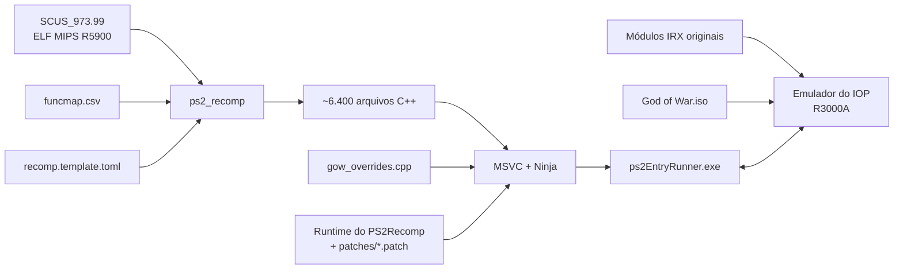

<div align="center">

# God of War — PS2 Static Recompilation

[English](README.md) · [Español](README.es.md) · **Português (Brasil)**

**Port nativo para PC de *God of War* (PS2, NTSC-U `SCUS-97399`) feito por recompilação estática de código MIPS R5900 para C++.**


[](https://github.com/KIexster/god-of-war-recomp/actions/workflows/pruebas.yml)

</div>

---

> [!IMPORTANT]
> Este repositório **não contém nenhum arquivo do jogo** (ISO, executável, módulos IRX ou dados `.PAK`),
> nem o código C++ gerado a partir deles. Você precisa da **sua própria cópia legal** de God of War para PS2.

## Sumário

- [O que é](#o-que-é)
- [Status atual](#status-atual)
- [Estrutura do repositório](#estrutura-do-repositório)
- [Requisitos](#requisitos)
- [Compilar e executar](#compilar-e-executar)
- [Como funciona](#como-funciona)
- [Documentação](#documentação)
- [Créditos e licença](#créditos-e-licença)

## O que é

Em vez de emular o PlayStation 2 instrução por instrução, este projeto **traduz o executável original do
jogo (`SCUS_973.99`) para C++** com o [PS2Recomp](https://github.com/ran-j/PS2Recomp) e o compila como um
programa nativo do Windows, ligado a um runtime que reimplementa o hardware e o sistema operacional do PS2
(kernel do EE, GS, DMA, CD/DVD…). O processador de E/S (IOP) executa os **módulos IRX originais** do jogo
(driver de som, streamer de dados…) no interpretador R3000A do PS2Recomp.

Este repositório contém tudo o que é específico de God of War:

| Componente | Descrição |
|---|---|
| **Mapa de funções** | 6.414 funções identificadas no ELF (`config/funcmap.csv`) |
| **Configuração do recompilador** | Stubs, pontos de entrada (incluindo métodos virtuais alcançados só por vtable) e patches de instruções (`config/recomp.template.toml`) |
| **Overrides do jogo** | Substituições e diagnósticos de funções do jogo (`src/gow_overrides.cpp`) |
| **Patch do runtime** | Correções no emulador do IOP e no runtime do EE do PS2Recomp necessárias para este jogo (`patches/`) |
| **Scripts de compilação** | Pipeline completo e reproduzível no Windows (`scripts/`) |
| **Ferramentas** | Extrator da camada 1 de DVD-9 (`tools/`) |

## Status atual

<a href="docs/estado/detalle.pt-BR.md"></a>

Detalhamento por biblioteca e por componente: [`docs/estado/detalle.pt-BR.md`](docs/estado/detalle.pt-BR.md). Regenerado a partir de `docs/estado/datos.toml` por `tools/estado/generar.py` (e automaticamente ao enviar para `main`).

| Marco | Status |
|---|:---:|
| Extração das duas camadas do DVD-9 | ✅ |
| Recompilação do `SCUS_973.99` para C++ (6.418 arquivos) | ✅ |
| Compilação do executável nativo (MSVC, x64) | ✅ |
| Boot: inicialização de raylib/OpenGL, heap e threads | ✅ |
| Módulos IRX originais do jogo no emulador do IOP (`989snd`, `smpd`, `libsd`…) | ✅ |
| Streaming de dados a partir da ISO original (`smpd` → `R_PERM.WAD`, configuração do jogo) | ✅ |
| Loop principal do jogo (`sys::GameLoop`) | ✅ |
| Saída de vídeo: tela legal e logo do título | ✅ |
| Barco, Kratos, inimigos e HUD com formas corretas; faltam outras verificações de renderização | 🔧 em andamento |
| Controle/teclado por HLE de libpad2; menu e seleção de dificuldade | ✅ |
| Partida alcançada; desempenho ainda de ~2–3 fps | 🔧 em andamento |
| Vídeo FMV: intro decodificada e exibida sem ser pulada; faltam outros vídeos | 🔧 em andamento |
| Áudio: bancos e som contínuo emulado verificados; saída com cortes na velocidade atual | 🔧 em andamento |
| Memory card: listar, carregar, salvar e recarregar verificados em uma cópia PCSX2; falta formatação | 🔧 em andamento |

O jogo inicializa, carrega seus dados a partir da ISO e chega ao menu e à partida com teclado ou controle.
Após corrigir as cadeias DMA do scratchpad, as capturas mostram o barco, Kratos, inimigos e HUD com formas
corretas. A intro FMV também é decodificada sem `GOW_SKIP_FMV`. Carregar, salvar e recarregar uma partida
foram verificados em uma cópia de cartão PCSX2 de 8 MB com ECC; faltam formatação e reabertura no PCSX2.
O port continua experimental: a partida roda a ~2–3 fps, o áudio tem cortes e faltam verificações das
diferenças CPU/OpenGL e da cobertura gráfica. Veja [renderização](docs/COMPARACION_PCSX2.md),
[FMV e áudio](docs/FMV_Y_AUDIO.md), [memory card](docs/MEMORY_CARD.md) e
[`docs/ESTADO.md`](docs/ESTADO.md) para as verificações e seus limites (em espanhol).

## Estrutura do repositório

```
.
├── .github/workflows/            # CI: testes (pruebas.yml) e mapa de status (estado.yml)
├── AGENTS.md                     # Convenções do projeto para colaboradores e agentes
├── config/
│   ├── funcmap.csv               # Mapa de funções (nome, início, fim, tamanho)
│   └── recomp.template.toml      # Configuração do PS2Recomp (@ELF@, @MAP@, @OUT@)
├── docs/                         # Documentação técnica (em espanhol)
│   └── estado/                   # Dados do mapa de status e SVG/tabelas gerados
├── game/                         # O SEU SCUS_973.99 vai aqui (ignorado pelo git)
├── patches/
│   └── ps2recomp-*.patch         # Alterações sobre o PS2Recomp @ c5a9d02, aplicadas em ordem
├── scripts/
│   ├── 1_instalar_herramientas.cmd  # Instala as ferramentas
│   ├── 2_compilar.cmd               # Pipeline completo de compilação
│   ├── 2_recompilar_rapido.cmd      # Recompila só src/gow_overrides.cpp (~1 min)
│   ├── 3_ejecutar.cmd               # Executa por 60 s e guarda os logs
│   ├── 3_ejecutar_manual.cmd        # Executa sem limite de tempo
│   ├── probar_menu.ps1              # Teste do menu com capturas do GS
│   ├── probar_pad2.cmd              # Compila e executa o teste de pacotes da libpad2
│   ├── monitor.cmd                  # Monitora CPU/RAM durante a compilação
│   └── *.ps1                        # Lógica dos scripts
├── src/
│   ├── gow_overrides.cpp         # Overrides específicos do jogo
│   └── gow_pad2_packet.h         # Formato do pacote da libpad2 (testado)
├── tests/                        # Testes independentes do jogo e falhas conhecidas da suíte
└── tools/
    ├── ci/                       # Auxiliares da CI (ordem dos patches, config, testes)
    ├── extraer_capa2.ps1         # Extrai a camada 1 de uma ISO DVD-9 de PS2
    └── estado/generar.py         # Gerador do mapa de status
```

> Os nomes de scripts e pastas estão em espanhol, o idioma original do projeto.

## Requisitos

- Windows 10/11 x64
- [Visual Studio 2022 Build Tools](https://visualstudio.microsoft.com/downloads/) com a carga de trabalho **C++** (inclui CMake e Ninja)
- [Git](https://git-scm.com/)
- ~10 GB livres; 16 GB de RAM recomendados (a compilação usa todos os núcleos)
- Uma cópia própria de **God of War (NTSC-U, SCUS-97399)**

`scripts\1_instalar_herramientas.cmd` instala o Git e as Build Tools com o `winget`.

## Compilar e executar

**1. Obtenha os arquivos do jogo.** Copie o executável do seu disco/ISO para `game\SCUS_973.99`
(ou aponte a variável de ambiente `GOW_ELF` para ele).

Coloque os **módulos `.IRX`** do disco (`SMPD_IOP.IRX`, `989NOMID.IRX`, `LIBSD.IRX`…) ao lado do ELF: o
emulador do IOP executa os originais, e o `scripts\ejecutar.ps1` os copia para `IOP_MOD\` na primeira
execução. Para ler os dados do jogo é preciso a **ISO original**: dê a ela o nome `God of War.iso` e
coloque-a na pasta acima da pasta do ELF, ou defina a variável de ambiente `GOW_ISO` com o caminho dela.

Para extrair também os dados da segunda camada do DVD:

```powershell
powershell -ExecutionPolicy Bypass -File tools\extraer_capa2.ps1 -Iso "D:\God of War.iso" -Salida "D:\GOW ISO extraida"
```

**2. Instale as ferramentas** (só na primeira vez):

```bat
scripts\1_instalar_herramientas.cmd
```

**3. Compile** (20–40 min na primeira vez):

```bat
scripts\2_compilar.cmd
```

O script clona o PS2Recomp em `<unidade>:\gowport` (um caminho curto para evitar o limite de 260
caracteres; configurável com `GOW_WORK`), fixa o commit `c5a9d02`, aplica os patches de `patches/`, gera o código C++ e
compila o `ps2EntryRunner.exe`. O log fica em `logs\2_compilar.log`.

As compilações Release desativam por padrão as trilhas de funções e RPC do IOP. Para investigar,
use `scripts\2_compilar.cmd -Trazas`. Para medir as chamadas a `vid::Flip` do jogo separadamente
da atualização da janela, execute `powershell -File scripts\probar_rendimiento.ps1`;
consulte [as notas do perfil](docs/ESTADO.md#medicion-de-rendimiento-2026-10-05).

**4. Execute:**

```bat
scripts\3_ejecutar.cmd          :: 60 segundos, saída em logs\
scripts\3_ejecutar_manual.cmd   :: sem limite
```

## Como funciona



Mais detalhes em [`docs/ARQUITECTURA.md`](docs/ARQUITECTURA.md) (em espanhol).

## Documentação

A documentação técnica está atualmente em espanhol:

- [`docs/ARQUITECTURA.md`](docs/ARQUITECTURA.md) — pipeline, overrides, patches do runtime e integração contínua
- [`docs/CONTROLES.md`](docs/CONTROLES.md) — controles e testes do controle e do menu
- [`docs/RENDERIZADO.md`](docs/RENDERIZADO.md) — renderers CPU/CPU com thread/OpenGL opcionais e comparações
- [`AGENTS.md`](AGENTS.md) — convenções do projeto para colaboradores e agentes
- [`docs/ESTADO.md`](docs/ESTADO.md) — status atual, registro da investigação, problemas conhecidos e próximos passos

## Créditos e licença

- [**PS2Recomp**](https://github.com/ran-j/PS2Recomp), de ran-j e colaboradores — recompilador e runtime (GPL-3.0).
- [**Fork do runtime de SotC**](https://github.com/LightVelox/PS2Recomp/tree/ac9efa070638ad3b3accd284de6f898d5ab271d1), de Taylor N. Albarnaz / LightVelox — backend GS OpenGL e fila de comandos, e correções do EE (FPU, desvios de 64 bits, LQ/SQ, saltos finais, VU0 em modo macro e cadeias DMA longas) (GPL-3.0, `ac9efa0`).
- *God of War* © Sony Interactive Entertainment / Santa Monica Studio. Este projeto não é afiliado nem
  endossado pela Sony. Nenhum conteúdo do jogo é distribuído.

O código deste repositório é publicado sob a licença **GPL-3.0**, em consonância com o PS2Recomp.
Veja [`LICENSE`](LICENSE).
