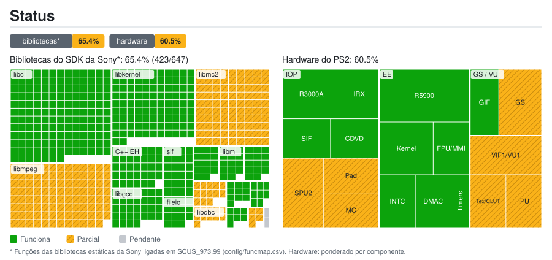

# Status do port: detalhes

Gerado por `tools/estado/generar.py` a partir de `docs/estado/datos.toml` e `config/funcmap.csv`. Não edite à mão.

## Bibliotecas do SDK da Sony*: 65.4% (423/647)

| Biblioteca | Funções | Status | Nota |
|---|---:|---|---|
| `libmpeg` | 103 | 🔧 Parcial | A intro FMV é decodificada por software e exibida sem GOW_SKIP_FMV; os demais vídeos ainda precisam ser verificados |
| `libipu` | 5 | 🔧 Parcial | sceIpuInit corrigido; a rota MPEG por software funciona, mas a cobertura completa das operações da IPU não foi verificada |
| `libgraph` | 7 | ✅ Funciona |  |
| `libdma` | 8 | ✅ Funciona |  |
| `libcdvd` | 10 | ✅ Funciona | Lê a ISO original |
| `libdbc` | 11 | 🔧 Parcial | RPC de dbcman e SIO2 verificados ao carregar e salvar no cartão; os controles SIO2 ainda aparecem desconectados |
| `libpad2` | 13 | 🔧 Parcial | HLE da primeira porta (teclado ou gamepad); pressões 0/255 |
| `libvib` | 2 | ⏳ Pendente | Sem vibração: o HLE não anuncia atuadores |
| `libmc2` | 90 | 🔧 Parcial | Listar, carregar, salvar e recarregar verificados com uma cópia de cartão PCSX2 de 8 MB com ECC; faltam formatação e reabertura no PCSX2 |
| `libscf` | 14 | ✅ Funciona |  |
| `libgcc` | 32 | ✅ Funciona |  |
| `C++ EH` | 34 | ✅ Funciona |  |
| `libm` | 14 | ✅ Funciona |  |
| `libc` | 150 | ✅ Funciona |  |
| `libkernel` | 101 | ✅ Funciona |  |
| `sif` | 24 | ✅ Funciona | Comandos e RPC do SIF |
| `fileio` | 15 | ✅ Funciona |  |
| `loadfile` | 14 | ✅ Funciona | Heap do IOP e carga de módulos |

## Hardware do PS2: 60.5%

| Grupo | Componente | Peso | Status | Nota |
|---|---|---:|---|---|
| EE | CPU R5900 (recompilada para C++) | 5 | ✅ Funciona |  |
| EE | Kernel: threads, semáforos e alarmes | 3 | ✅ Funciona |  |
| EE | FPU (COP1) e instruções MMI | 2 | ✅ Funciona |  |
| EE | INTC: VSync e interrupção do GS | 2 | ✅ Funciona |  |
| EE | Controlador DMA | 2 | ✅ Funciona | As cadeias fromSPR/toSPR já copiam a paleta de ossos; formas de Kratos e inimigos verificadas na partida |
| EE | Temporizadores | 1 | ✅ Funciona |  |
| GS / VU | GS: primitivas e framebuffer | 3 | 🔧 Parcial | CPU/OpenGL mantidos; barco, Kratos, inimigos e HUD visíveis. Ordem cor/Z e aliases por largura/volta validados. Feedback instável limitado a 33 envios; snapshot opcional estável em 64 passagens, ainda diferente da CPU. Z de somente leitura retido; profiler GPU por variante e limite de consultas verificado; falta cobertura completa |
| GS / VU | VIF1 e VU1 | 3 | 🔧 Parcial | Blocos compilados, flags persistentes, SSE de quatro vias e vínculo opcional do microcódigo local integrados; regressão FTZ/DAZ preserva underflow. Modelos e HUD visíveis após MMI/EFU/SPR; falta verificar cobertura e rendimento sustentado |
| GS / VU | GS: texturas, CLUT e fontes | 2 | 🔧 Parcial | HUD visível; bilinear e nearest STQ CPU/OpenGL verificados, incluindo limites 16.16 com sinal, com padrões procedurais de PCSX2 software; feedback GPU estável em modo experimental; lotes de texturas regionais otimizados e verificados nos 13 PSMs; cache GS real e cobertura de fontes/CLUT ainda não verificadas |
| GS / VU | GIF (PATH1-3) | 2 | ✅ Funciona |  |
| GS / VU | IPU: vídeo FMV | 2 | 🔧 Parcial | A intro FMV funciona por decodificação MPEG por software; isso não comprova emulação completa do hardware IPU |
| IOP | CPU R3000A (interpretador) | 3 | ✅ Funciona | Escalonador ocioso de Opus integrado e validado com GS/VU1: guarda o próximo despertar; seu perfil reduz IOP de ~1300–1500 para ~570–650 ms a cada 5 s; falta comparar FPS sem compilações simultâneas |
| IOP | SPU2: saída de áudio | 3 | 🔧 Parcial | Carregamento de bancos e som contínuo em tempo emulado verificados; a ~2 fps o áudio tem cortes; faltam reverb e ADMA |
| IOP | Módulos IRX originais | 2 | ✅ Funciona |  |
| IOP | SIF: RPC e DMA EE ↔ IOP | 2 | ✅ Funciona |  |
| IOP | CDVD: leitura da ISO original | 2 | ✅ Funciona |  |
| IOP | Controle DualShock 2 | 2 | 🔧 Parcial | libpad2 por HLE (primeira porta); no SIO2 emulado os controles aparecem desconectados |
| IOP | SIO2: memory card | 2 | 🔧 Parcial | SIO2 e cartão de 8 MB com ECC: carregar, salvar e recarregar verificados no jogo em uma cópia PCSX2; faltam formatação e reabertura no PCSX2 |

* Funções das bibliotecas estáticas da Sony ligadas em SCUS_973.99 (config/funcmap.csv). Hardware: ponderado por componente.
